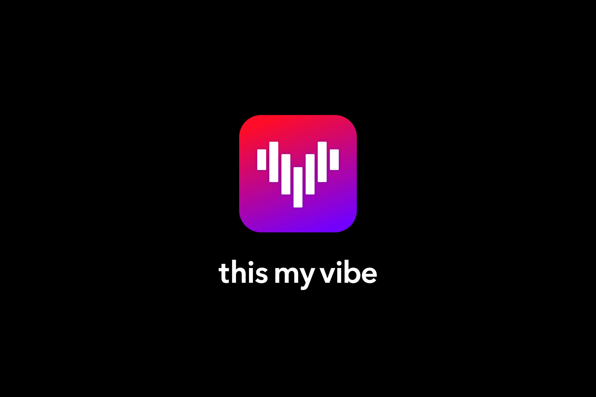

# Vibe Custom Clone Project

## Vibe를 내 맘대로 바꿔보자 👊

- [음악 재생 앱 Vibe](https://vibe.naver.com/)
- 나의 Vibe 이용권 남은 기간 : 1년 9개월
- Vibe를 사용하면서 불편했던 점들도 수정해보자!

---

## 프로젝트 선정 과정

### 1. 나는 Vibe 사용자

- Vibe를 이용하면서 불편한 점들을 자연스럽게 느꼈고, 직접 수정한 앱을 만들어 보고 싶었다.

### 2. 예쁜 UI

- 디자인을 직접하면서 뭔가를 만들기에는 능력적, 시간적 제한이 존재
- Vibe 사용하면서 UI가 힙하다고 느꼈는데, 카피하면서 만들기 좋을 것 같다.

### 3. 대규모 애플리케이션

- React 연습용 프로젝트를 진행하려면 약간 규모가 있어야 한다고 생각한다.
- 소규모 프로젝트에는 Vue.js나 svelte가 훨씬 적합하다고 생각
- React의 철학 자체도 '지속적으로 데이터가 변경되는 대규모 애플리케이션을 만들기 위함'이기 때문에 이런 저런 기능들이 많은 Vibe같은 앱이 좋을 것 같았다.

---

## 프로젝트 목표

### 1. React 공부

- Function Component, hook 기반의 React 프로젝트 진행
- Custom hook을 최대한 활용하자

### 2. 문서를 많이 남기자

- 공부한 내용들을 기반으로 블로그를 작성하자
- 업로드는 최소 1주 1글

### 3. 자동 배포

- 자동 배포를 공부해서 성공시키자

### 4. 일정 관리

- 혼자 하는 프로젝트이지만, 자체적으로 마일스톤 생성해서 일정을 잘 관리하자

---

## 기술 스택

### Common

### Frontend

### Backend

### Etc

